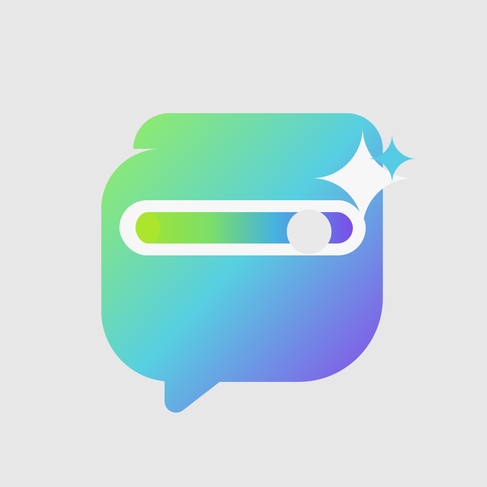
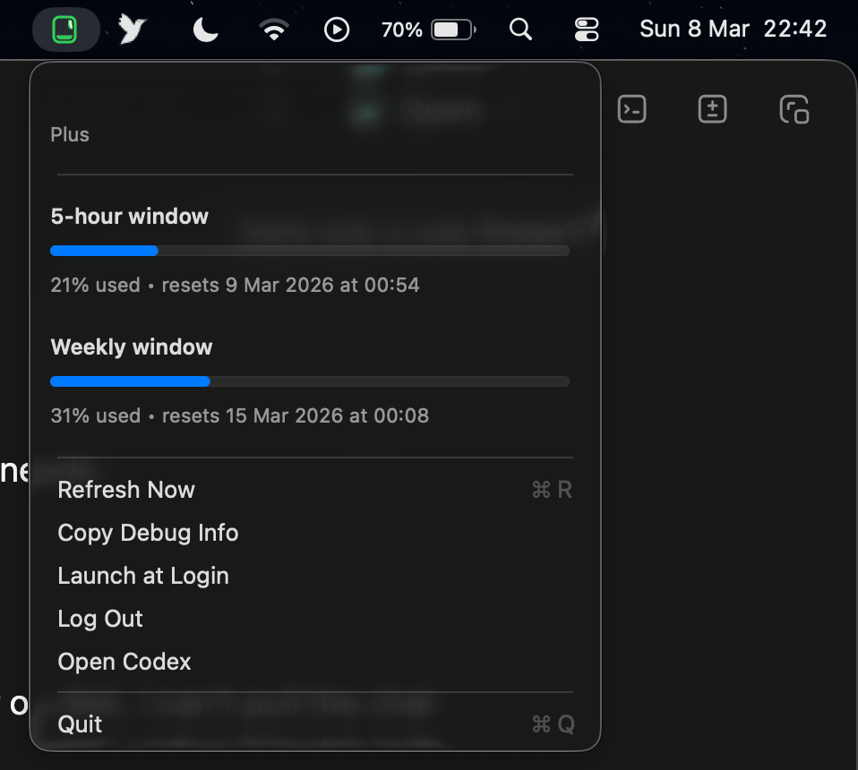

# CodexPeek



The lightest Codex usage menu bar app for macOS.

CodexPeek is a native `AppKit` menu bar utility that shows your Codex 5-hour and weekly usage without a browser shell, Electron runtime, or persistent background helper. It is built to stay out of the way: fast to launch, low on heat, and glanceable from the menu bar.



CodexPeek exists because a lot of utility apps in this space take the heavier route:
- web runtimes
- embedded browser views
- always-running helper processes
- more UI framework overhead than the job actually needs

Those choices can be reasonable for feature-heavy apps, but they usually cost more RAM, more wakeups, and more background activity. CodexPeek is intentionally optimized for the opposite tradeoff: do less, stay native, and keep the footprint small.

## Why CodexPeek

- Native macOS app, built with `Swift + AppKit`
- No Electron, no webview, no Tauri
- No always-on Codex helper process
- Reads live usage from the official local `codex app-server` protocol
- Falls back gracefully to local Codex session data and cache
- Auto-detects the signed-in Codex account
- Supports launch at login

Measured locally on Apple silicon during development:
- Idle CPU: effectively `0%`
- Idle memory: about `12 MB` in `top`
- Refreshes happen on demand and once per minute, with brief transient spikes only while talking to Codex

## macOS Only

CodexPeek currently targets `macOS 14+`.

## Install

### Download a release

Once releases are published, download either:
- `CodexPeek.dmg`
- `CodexPeek.zip`

Move `CodexPeek.app` into `/Applications`, open it once, then enable `Launch at Login` from the menu if you want it to start automatically.

### Unsigned app warning

CodexPeek is currently distributed as an unsigned macOS app.

That means macOS may show a warning the first time you open it, because the app is not yet signed and notarized with an Apple Developer account. The app still runs fine, but first launch may require one extra step.

If macOS blocks the app:

1. Move `CodexPeek.app` into `/Applications`
2. Right-click the app and choose `Open`
3. Click `Open` in the confirmation dialog

If macOS still blocks it, go to `System Settings > Privacy & Security` and allow the app there, then launch it again.

### Build locally

Requirements:
- macOS 14+
- Swift 6 toolchain
- Codex CLI installed and available via `PATH`, `CODEX_CLI_PATH`, `/opt/homebrew/bin/codex`, or `/usr/local/bin/codex`

Run directly:

```bash
swift run CodexPeek
```

Build the `.app`:

```bash
./Scripts/build_app.sh
```

Build a distributable `.zip`:

```bash
./Scripts/build_release.sh
```

Build a `.dmg`:

```bash
./Scripts/build_dmg.sh
```

## How It Works

CodexPeek refreshes usage by spawning:

```bash
codex app-server --listen stdio://
```

It then reads:
- account identity
- plan type
- 5-hour usage window
- weekly usage window

If live refresh fails, it falls back in this order:
1. latest local Codex session log usage event
2. last saved snapshot cache

Account identity also falls back to local `~/.codex/auth.json` metadata so the signed-in label remains useful even when usage data is stale.

## Development

Run the built-in self-tests:

```bash
swift run CodexPeek --self-test
```

Project structure:
- [`Sources/CodexPeek`](./Sources/CodexPeek): native app source
- [`Scripts/build_app.sh`](./Scripts/build_app.sh): build a local `.app`
- [`Scripts/build_release.sh`](./Scripts/build_release.sh): build a release `.zip`
- [`Scripts/build_dmg.sh`](./Scripts/build_dmg.sh): build a release `.dmg`
- [`AppResources`](./AppResources): app metadata and icon assets

## Roadmap

- Signed and notarized public releases
- Better onboarding for first launch
- Release screenshots
- Optional update channel / auto-update strategy

## Why macOS warns on first launch

Unsigned apps trigger Gatekeeper warnings because Apple cannot verify the developer identity or notarization status. That warning is expected for the current public builds and does not mean CodexPeek is broken.

The long-term plan is to ship signed and notarized releases. Until then, GitHub releases will include unsigned `.zip` and `.dmg` artifacts with the install steps above.

## Contributing

Issues and PRs are welcome. Keep changes aligned with the project’s core goal:

`lowest-overhead Codex usage visibility on macOS`
