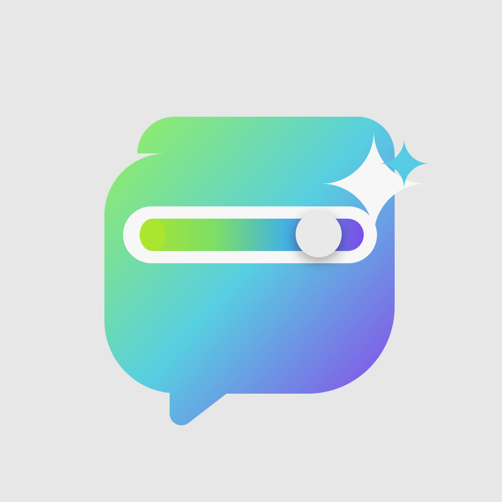
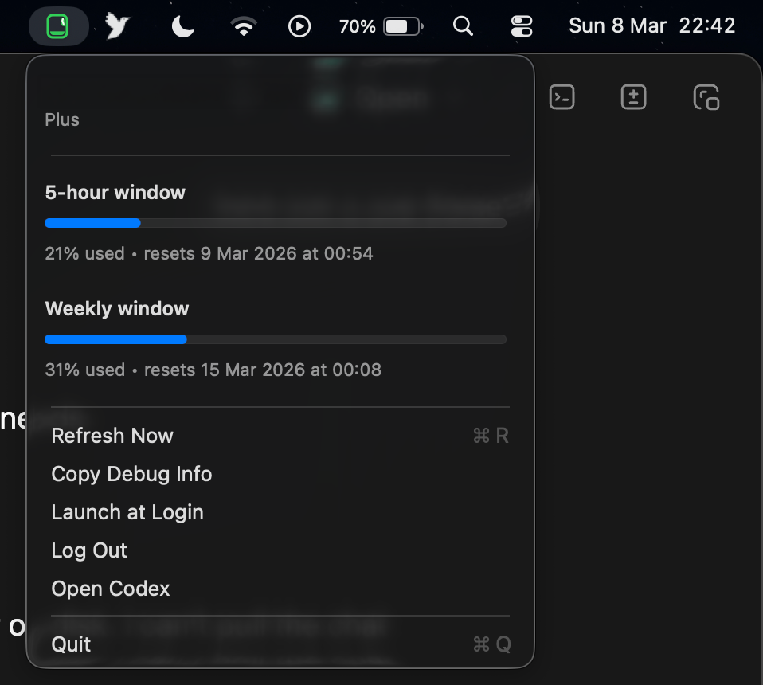

<p align="center">
  
</p>

<h1 align="center">CodexPeek</h1>

<p align="center">Codex and Claude Code usage in your macOS menu bar.</p>

<p align="center">
  macOS 14+ · Swift 6<br>
  <a href="#install">Install</a> ·
  <a href="Docs/USAGE.md">Data and estimates</a> ·
  <a href="https://github.com/20ns/CodexPeek/issues">Report a bug</a>
</p>

<p align="center">
  <a href="https://github.com/20ns/CodexPeek/actions/workflows/ci.yml"></a>
</p>

CodexPeek shows your 5-hour and weekly limits, how much you've used, and when they reset. Open Usage History for token counts and API-equivalent cost estimates by model.

The menu is native AppKit. The history window uses Swift Charts. There are no package dependencies, and the Codex helper runs only when the app needs it.

<p align="center">
  
  <br>
  <sub>An earlier Codex-only build. Current builds also include Claude Code and Usage History.</sub>
</p>

## What you can see

- Codex 5-hour and weekly usage, reset countdowns, and Spark limits when available.
- Claude Code 5-hour and weekly usage in a separate section.
- Daily and hourly token history by model, including retained archived Codex sessions and Claude subagent logs.
- Codex, Claude Code, or combined history, with API-equivalent estimates for the last 7 days, 30 days, and all retained logs.
- The active Codex account and plan, with account switching from the menu.

Usage refreshes every five minutes. Use the refresh button to pull it immediately. Launch at Login is available in the app menu.

Dollar amounts estimate what the recorded tokens would cost at API rates. They are not your subscription bill. Missing logs and unknown model prices can leave gaps.

## Install

Build from source for now. There are no published downloads on the [releases page](https://github.com/20ns/CodexPeek/releases) yet.

You'll need macOS 14 or later, a Swift 6 toolchain, and the Codex CLI installed and signed in. Claude Code usage needs a signed-in Claude Code account.

```sh
git clone https://github.com/20ns/CodexPeek.git
cd CodexPeek
./Scripts/build_app.sh
open .build/CodexPeek.app
```

To use Launch at Login, move `CodexPeek.app` from `.build` into `/Applications` and open it there.

The app finds `codex` on `PATH` and in common Homebrew and user install directories. For another location, set `CODEX_CLI_PATH` when launching it:

```sh
CODEX_CLI_PATH=/path/to/codex .build/CodexPeek.app/Contents/MacOS/CodexPeek
```

The build scripts produce an unsigned app. If macOS blocks it, allow it in System Settings > Privacy & Security, then open it again. Signed and notarized releases are still planned.

## Where the data comes from

Codex limits come from the local `codex app-server` protocol. The app starts a process for each refresh and stops it afterward. If that fails, it uses local session data or a saved snapshot and marks the result as an estimate.

Claude limits come from Anthropic's usage endpoint using your existing Claude Code credentials. An optional status-line bridge can update readings between refreshes. The endpoint is not a documented public API, so changes to it may require an app update.

Token history and cost estimates come from local session logs. CodexPeek parses them on your Mac and caches unchanged files between scans.

See [data and estimates](Docs/USAGE.md) for account behavior, credential handling, refresh timing, pricing caveats, and the Claude status-line setup.

## Development

Run the app without packaging it:

```sh
swift run CodexPeek
```

Run the built-in checks:

```sh
swift run CodexPeek --self-test
./Scripts/check_auth_watcher.sh
./Scripts/check_refresh_cadence.sh
```

Builds go to `.build/CodexPeek.app`. To package a ZIP or DMG:

```sh
./Scripts/build_release.sh
./Scripts/build_dmg.sh
```

These write `dist/CodexPeek.zip` and `dist/CodexPeek.dmg`. Both scripts run the self-tests before packaging. See the [release checklist](Docs/RELEASE.md) for publishing steps.

| Path | Contents |
| --- | --- |
| [Sources/CodexPeek](Sources/CodexPeek) | App, usage readers, history, and self-tests |
| [AppResources](AppResources) | App metadata and icon |
| [Scripts](Scripts) | Builds and regression checks |

## Contributing

Bug reports and pull requests are welcome. Include your macOS version, how you installed CodexPeek, and the steps that reproduce the problem. Remove account details and tokens from anything you share.

Keep changes small. Reuse the native controls and existing helpers, avoid new dependencies where possible, and run the checks above before opening a PR.
